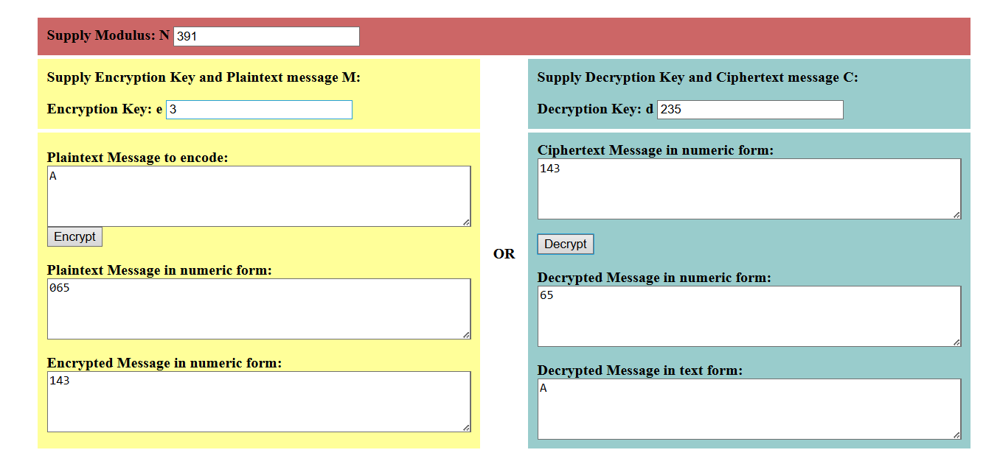

# 🔐 Projeto RSA com Comunicação TCP e Criptografia no Banco de Dados

## 👥 Integrantes do Grupo
- **Caroline Assis Silva – RM 557596**
- **Eduardo Guilherme – RM 557886**
- **Enzo de Moura Silva – RM 556532**
- **Luis Henrique Gomes Cardoso – RM 558883**

**IDE Utilizada:** Eclipse  
**Tecnologias:** Java, Sockets TCP, RSA, Spring Boot, MySQL

---

## 📝 **Descrição do Projeto**

Este projeto implementa uma comunicação **Cliente ↔ Servidor via Socket TCP**, utilizando o algoritmo de criptografia **RSA (Rivest–Shamir–Adleman)** de forma **manual**, com os valores definidos pelo grupo (sem uso de bibliotecas de segurança do Java).

Além disso, a aplicação também utiliza RSA para **criptografar dados sensíveis no banco**, como **CPF e Endereço**, garantindo maior segurança das informações.

O sistema possui **duas camadas independentes**, ambas usando RSA:

| Camada | Função | Criptografia |
|---------|---------|--------------|
| **Socket TCP** | Envio de mensagem criptografada Cliente ↔ Servidor | RSA manual |
| **API + Banco** | CRUD com CPF e Endereço criptografados | RSA manual |

---

## 🔒 **RSA Implementado (manual)**

Foram escolhidos os seguintes valores:

| Valor | Resultado |
|--------|-----------|
| `p = 17` | `q = 23` |
| `n = p*q = 391` |
| `φ(n) = 352` |
| `e = 3` (chave pública) |
| `d = 235` (chave privada) |

Fórmulas utilizadas:
c = m^e mod n (Criptografar)
m = c^d mod n (Descriptografar)

---

## 🧪 **Validação no Simulador Drexel**

Mensagem testada: **"A"**

| Etapa | Valor |
|---------|--------|
| ASCII | `65` |
| Criptografia | `65³ mod 391 = 143` |
| Descriptografia | `143^235 mod 391 = 65 → "A"` |

📌 *Print da verificação:*



---

## 🔁 **Handshake no Socket TCP**

### Fluxo da troca de chaves:

Cliente → envia chave pública (e, n)

Servidor → envia chave pública (e, n)

Cliente → envia mensagem criptografada com chave pública do Servidor

Servidor → descriptografa com chave privada

Servidor → envia resposta criptografada com chave pública do Cliente

Cliente → descriptografa a resposta

---

## 📩 **Fluxo da Comunicação (Console)**

Exemplo de saída do Socket:

 ✅ Servidor aguardando conexão
 
 🔑 Chave pública do Cliente recebida: (3, 391)
 
 🔑 Chave pública do Servidor enviada: (3, 391)
 
 📥 Mensagem recebida (cifrada): [143, ...]
 
 📥 Mensagem decriptada: Olá servidor
 
 📤 Resposta enviada (cifrada)
 
 ❌ Conexão encerrada


---

## 🗄️ **Criptografia no Banco de Dados**

- CPF e Endereço são armazenados **criptografados (Base64)**
- Ao consultar via API, os dados retornam **em texto claro**

📌 *Print do banco criptografado:*


---

## 🐬 **Subindo o Banco de Dados com Docker**

Para subir o MySQL via Docker:

```bash
docker run --name mysql-supermarket ^
 -e MYSQL_ROOT_PASSWORD=123 ^
 -e MYSQL_DATABASE=db ^
 -e MYSQL_USER=db ^
 -e MYSQL_PASSWORD=123 ^
 -p 3306:3306 ^
 -d mysql:8
```

## ▶️ Como Executar o Projeto

### 1) Clonar o repositório
git clone https://github.com/codecrazes/CP5_JAVA_part1.git
cd CP5_JAVA_part1

### 3) Rodar a aplicação backend
mvn spring-boot:run

### 4) Testar no navegador
Abra:
http://localhost:8082/clientes/formulario

### 5) Exemplo de cadastro (com o print):
Nome: Maria  
CPF: 777.777.777-77  
Telefone: 22222222222  
Endereço: rua da flores

Executar o Servidor Socket
ServidorTCP.iniciar();

Executar o Cliente Socket
ClienteTCP.enviarMensagem("Olá servidor");


